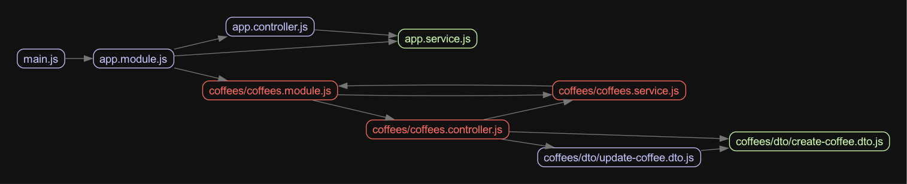

# 🚀 Advanced NestJS Concepts

<p align="center">
  <a href="http://nestjs.com/" target="blank">
    
  </a>
</p>

<p align="center">
  <strong>A progressive <a href="http://nodejs.org" target="_blank">Node.js</a> framework for building efficient and scalable server-side applications.</strong>
</p>

<p align="center">
  <a href="https://www.npmjs.com/~nestjscore" target="_blank">
    
  </a>
  <a href="https://www.npmjs.com/~nestjscore" target="_blank">
    
  </a>
  <a href="https://www.npmjs.com/~nestjscore" target="_blank">
    
  </a>
  <a href="https://circleci.com/gh/nestjs/nest" target="_blank">
    
  </a>
  <a href="https://discord.gg/G7Qnnhy" target="_blank">
    
  </a>
  <a href="https://opencollective.com/nest#backer" target="_blank">
    
  </a>
  <a href="https://opencollective.com/nest#sponsor" target="_blank">
    
  </a>
  <a href="https://paypal.me/kamilmysliwiec" target="_blank">
    
  </a>
  <a href="https://opencollective.com/nest#sponsor" target="_blank">
    
  </a>
  <a href="https://twitter.com/nestframework" target="_blank">
    
  </a>
</p>

---

## 📋 Description

This repository showcases **advanced NestJS concepts** including lazy-loading modules, custom decorators, and the powerful `DiscoveryService` for dynamic provider exploration.

Built with [Nest](https://github.com/nestjs/nest) framework TypeScript starter.

---

## 🛠️ Project Setup

### Installation

```bash
npm install
```

### Development Commands

```bash
# 🚀 Development mode
npm run start

# 👀 Watch mode (recommended for development)
npm run start:dev

# 🏭 Production mode
npm run start:prod
```

### Testing

```bash
# 🧪 Unit tests
npm run test

# 🔍 End-to-end tests
npm run test:e2e

# 📊 Test coverage
npm run test:cov
```

---

## 🐛 Debugging Common Errors

### Debug Mode
Start the development server with debug mode enabled:
```bash
NEST_DEBUG=true npm run start:dev
```

### Circular Dependencies Detection

Check for circular references using **madge**:
```bash
npx madge dist/main.js --circular
```

Generate a visual dependency graph:
```bash
npx madge dist/main.js --image graph.png
```

**Example output:**


---

## 🔄 Lazy-Loading Modules

Lazy-loading modules are perfect for **not importing modules everywhere** in your project. Ideal for:
- 🕐 Cron jobs
- 🔌 Microservices
- 📦 Heavy modules
- 🎯 Conditional features

### Creating a Lazy Module

Generate a module without auto-import:
```bash
nest g mo rewards --skip-import
```

### Usage Example

Here's how to use lazy-loading with the rewards module:

```typescript
@Injectable()
export class CoffeesService {
  constructor(
    @Inject(COFFEES_DATA_SOURCE) dataSource: CoffeesDataSource,
    private readonly lazyModuleLoader: LazyModuleLoader,
  ) {}

  async create(createCoffeeDto: CreateCoffeeDto) {
    // 🔄 Lazy load RewardsModule
    const rewardsModuleRef = await this.lazyModuleLoader.load(() =>
      import('../rewards/rewards.module').then((m) => m.RewardsModule),
    );
    
    const { RewardsService } = await import('../rewards/rewards.service');
    const rewardsService = rewardsModuleRef.get(RewardsService);
    rewardsService.grantTo();
    
    return 'This action adds a new coffee';
  }
  
  // ... rest of the service
}
```

---

## 🔍 Using `DiscoveryService` in NestJS

This powerful module allows you to **dynamically explore providers** and inspect **metadata** associated with their classes or methods, using the tools provided by the NestJS core (`@nestjs/core`).

### 🎯 Usage Example: Custom CRON Service

#### 1. Create Custom Decorators

**Interval Host Decorator:**
```typescript
// src/scheduler/decorators/interval-host.decorator.ts
import { SetMetadata } from "@nestjs/common";

export const INTERVAL_HOST_KEY = 'INTERVAL_HOST_KEY';
export const IntervalHost: ClassDecorator = SetMetadata(INTERVAL_HOST_KEY, true);
```

**Interval Decorator:**
```typescript
// src/scheduler/decorators/interval.decorator.ts
import { SetMetadata } from "@nestjs/common";

export const INTERVAL_KEY = 'INTERVAL_KEY';
export const Interval = (ms: number) => SetMetadata(INTERVAL_KEY, ms);
```

#### 2. Create CRON Service

Create a service with methods wrapped with the interval decorator:

```typescript
// src/cron/cron.service.ts
import { IntervalHost } from 'src/scheduler/decorators/interval-host.decorator';
import { Interval } from 'src/scheduler/decorators/interval.decorator';

@IntervalHost
export class CronService {
    @Interval(1000)
    everySecond() {
        console.log('This will be logged every second 🐕');
    }
}
```

#### 3. Implement Discovery Service

Use the `DiscoveryService` to automatically find and schedule all decorated methods:

```typescript
// src/scheduler/interval.scheduler.ts
import { Injectable, OnApplicationBootstrap, OnApplicationShutdown } from "@nestjs/common";
import { DiscoveryService, MetadataScanner, Reflector } from "@nestjs/core";
import { INTERVAL_HOST_KEY } from "./decorators/interval-host.decorator";
import { INTERVAL_KEY } from "./decorators/interval.decorator";

@Injectable()
export class IntervalScheduler implements OnApplicationBootstrap, OnApplicationShutdown {
    constructor(
        private readonly discoveryService: DiscoveryService,
        private readonly reflector: Reflector,
        private readonly metadataScanner: MetadataScanner
    ) { }

    private readonly intervals: NodeJS.Timeout[] = [];

    onApplicationBootstrap() {
        const providers = this.discoveryService.getProviders();
        
        providers.forEach(wrapper => {
            const { instance } = wrapper;
            const prototype = instance && Object.getPrototypeOf(instance);

            if (!instance || !prototype) return;

            const intervalHost = this.reflector.get(INTERVAL_HOST_KEY, instance.constructor) ?? false;

            if (!intervalHost) return;

            const methodKeys = this.metadataScanner.getAllMethodNames(prototype);
            
            methodKeys.forEach(methodKey => {
                const interval = this.reflector.get(INTERVAL_KEY, instance[methodKey]);
                if (interval === undefined) return;

                const intervalRef = setInterval(instance[methodKey], interval);
                this.intervals.push(intervalRef);
            });
        });
    }

    onApplicationShutdown(_signal?: string) {
        this.intervals.forEach(interval => clearInterval(interval));
    }
}
```

---

## 🎉 Key Features

- ✅ **Lazy Module Loading** - Load modules on-demand
- ✅ **Custom Decorators** - Create powerful metadata-driven features
- ✅ **Discovery Service** - Dynamic provider exploration
- ✅ **Circular Dependency Detection** - Debug with visual graphs
- ✅ **Advanced CRON Scheduling** - Automatic method scheduling

---

## 📚 Learn More

- [NestJS Documentation](https://nestjs.com/)
- [Discovery Service Guide](https://docs.nestjs.com/fundamentals/dynamic-modules)
- [Custom Decorators](https://docs.nestjs.com/fundamentals/custom-decorators)